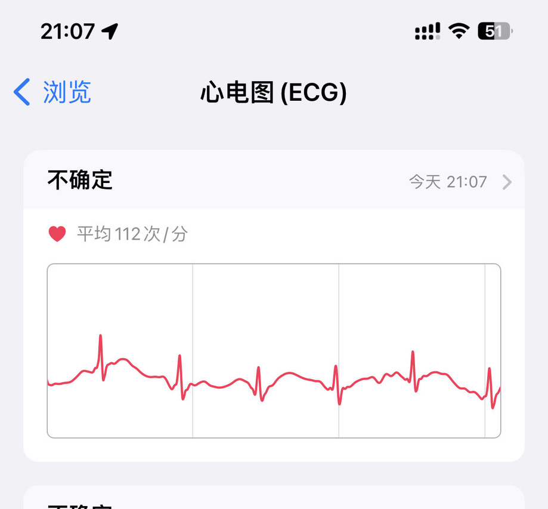
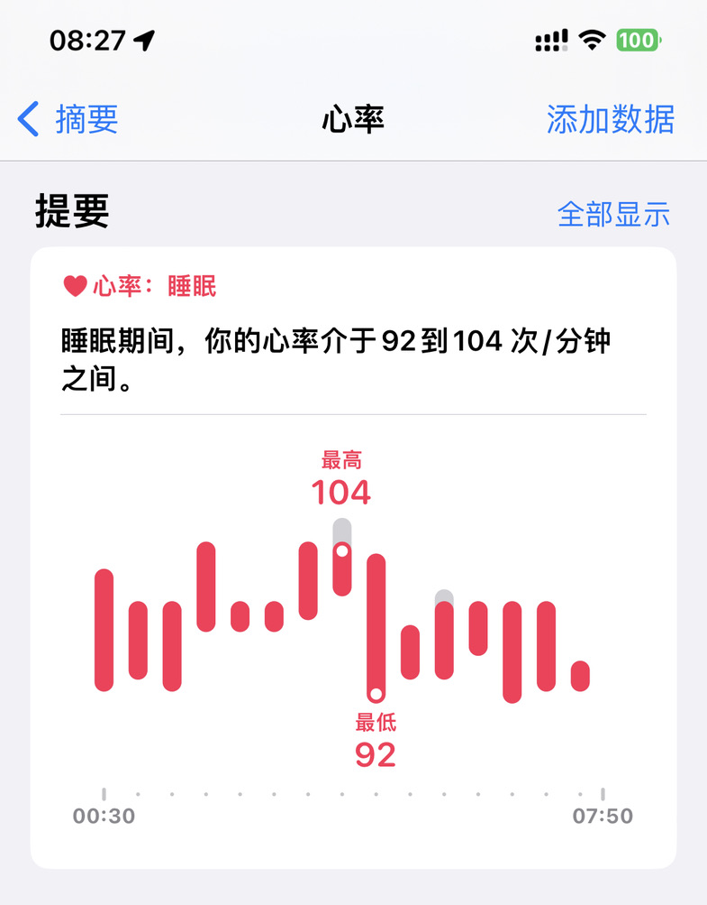
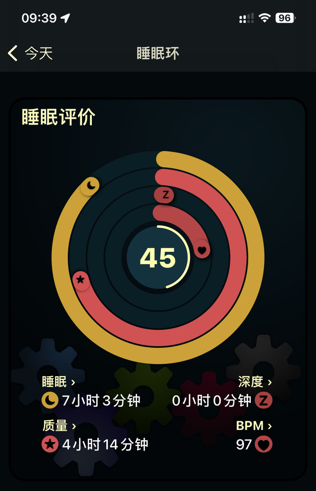
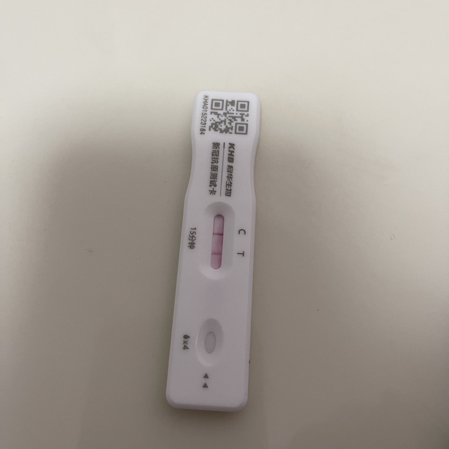
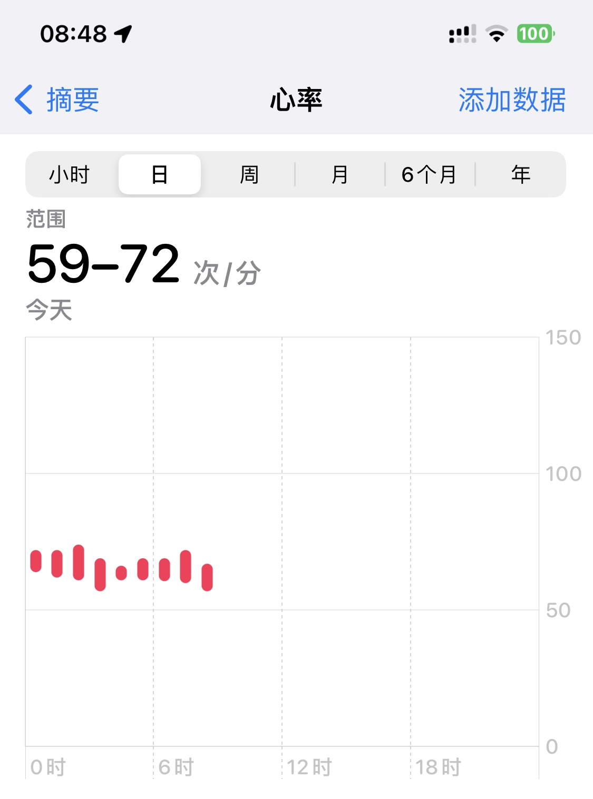

新冠 covid 中招碎碎帐

#### 2022-12-21 心率异常

- 全天心率 110 以上
- 头疼喉咙疼
- 体温 37.4 (可能电子不准), 睡觉前感觉已恢复
- 抗原未阳, 浪费一枚

#### 2022-12-22 浑身疼痛

- 睡眠心率 92-104, 睡眠环 45 分 (0 深度睡眠)
- 头疼喉咙吞咽疼, 浑身疼基本一夜未睡
- 体温感觉正常

#### 2022-12-23 抗原阳

- 体温感觉正常, 夜里有感觉发热, 早晨恢复

#### 2022-12-24

- 头疼喉咙疼, 浑身酸疼无力
- 咳嗽

#### 2022-12-26

- 头疼喉咙疼, 有鼻塞和鼻涕现象, 浑身酸疼无力
- 咳嗽, 开始啃龙角散
- 抗原继续阳, 浪费一枚

#### 2022-12-27

- 睡眠心率恢复正常
- 头疼喉咙疼, 有鼻塞和鼻涕现象, 浑身酸疼无力
- 咳嗽, 有少许咳痰, 继续啃龙角散

#### 补充中

...