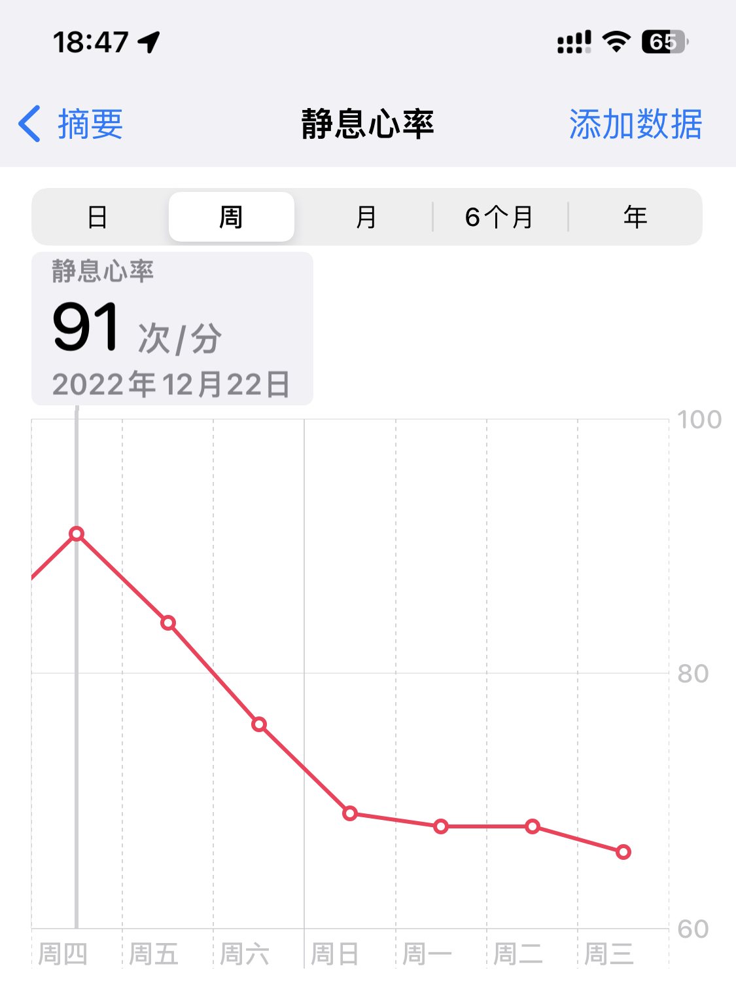
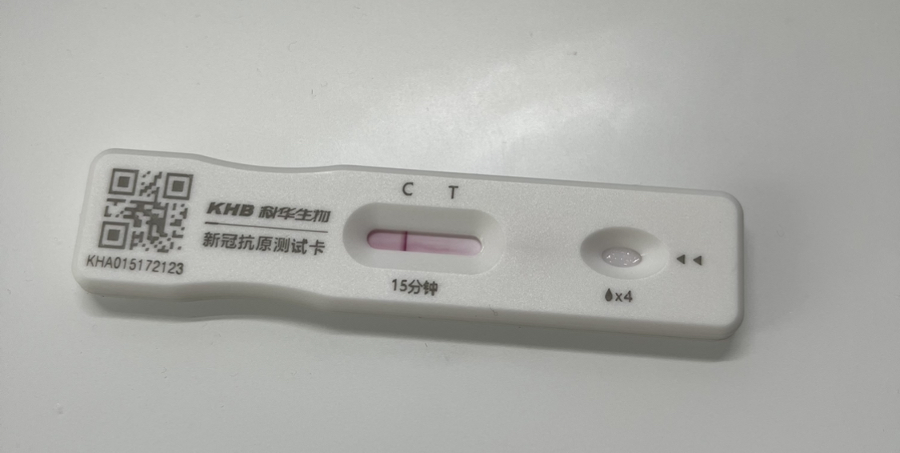
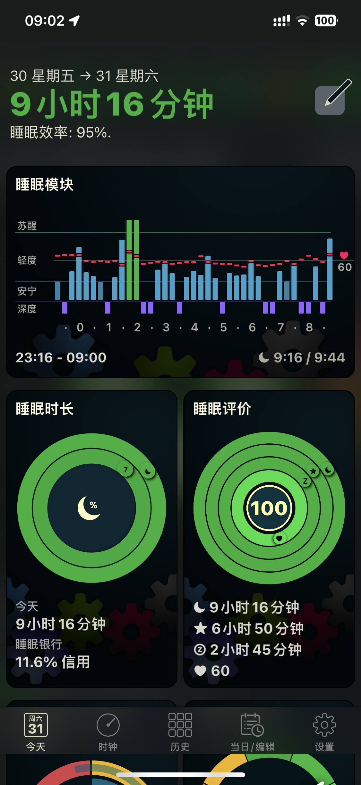
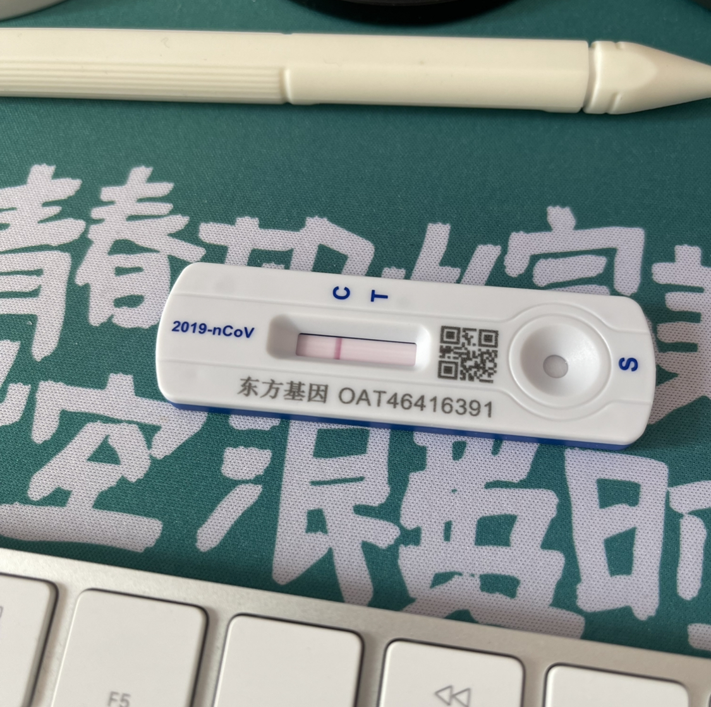

新冠 covid 中招碎碎帐

#### 2022-12-21

- 心率异常, 全天心率 > 110 (正常白天心率 < 100)
- 头疼喉咙疼
- 体温 37.4 (可能电子不准), 睡觉前感觉已恢复
- 抗原未阳, 浪费一枚

#### 2022-12-22

- 睡眠心率 92~104, 睡眠环 45 分, 深度睡眠 0 (正常睡眠心率 60~80, 睡眠环 > 80 分, 深度睡眠 > 2H)
- 头疼喉咙吞咽疼, 浑身疼基本一夜未睡 (这个非常惨, 感觉被人打了一顿)
- 体温自感觉正常

#### 2022-12-23

- 体温自感觉正常, 夜里有感觉发热, 早晨恢复正常
- 抗原阳

#### 2022-12-24

- 头疼喉咙疼, 浑身酸疼无力
- 咳嗽

#### 2022-12-26

- 头疼喉咙疼, 有鼻塞和鼻涕现象, 浑身酸疼无力
- 咳嗽, 开始啃龙角散
- 抗原继续阳, 浪费一枚

#### 2022-12-27

- 睡眠心率恢复正常
- 头疼喉咙疼, 有鼻塞和鼻涕现象, 浑身酸疼无力
- 咳嗽, 有少许咳痰, 继续啃龙角散

#### 2022-12-28

- 睡眠心率恢复正常, 静息回落至 60+ (2022-12-22 静息 91)
- 有鼻塞和鼻涕现象, 无力
- 咳嗽, 有少许咳痰, 继续啃龙角散
- 抗原继续阳, 浪费一枚

#### 2022-12-29

- 有鼻塞和鼻涕现象, 鼻音比较重
- 抗原转阴

#### 2022-12-30

- 抗原阴

#### 2022-12-31

- 睡眠恢复 (满环 100 分)
- 抗原阴

