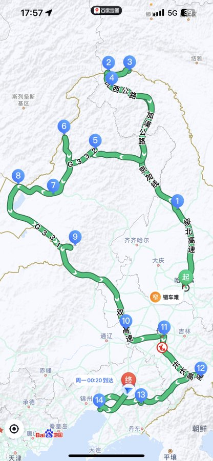

时间一直去, 回忆真美丽... 又是一年的碎碎念

## 工作

从去年下半年 (202209) 开始带监控团队和产品研发, 刚热乎就随即迎来了大考 (金融客户升级)

- 客户现场 “常驻” 一个月, 每天在 [“解惑答疑”、拆原始问题、排研发方案、催计划时间、..] 中反复
- 会议连轴: 解问题 收风险、听诉求 排规划、看方案 对进度.. 附带各种内外 “扯” (有线耳机才是王道, 随时在线)
- 提神三件套: 冰美式、黑乌龙和无糖可乐. 每天先桌上排好
- 连吃了一个月的味多美面包. 填饱肚子 省时省事
- <a href="/2022/12/27/covid-19/">阳了那个夜晚 (202212xx)</a>, 会议肝到凌晨四点、早上八点继续
- 版本变更的那个夜晚 (202303xx), 连续肝两个通宵
- 略略略..

软件产品 (tob) 跨大版本升级涉及面和风险因素真的是又多又广 [..] 还好在团队持续努力下顺利完成阶段性目标

前后几个月的过程很难, 坚持过去也挺多收获:

- 深入 监控领域、产品意识
- 提升 <u><b>学习思维、消化能力</b></u> (人、事、..)

对个人、团队以及产品来说, 真是过程饱满和挑战充满的一年!

### 学习思维

重点: 适应. 就像上学阶段, 年年换新升级. 设定个前提: <u><b>人和人是不一样的</b></u>. 每个人在不同纬度的世界, 不要试图去说服和改变别人

在意见和认知差异的情况下, 需要花费足够的时间精力, 代入和理解对面世界, 换位寻找 “求同” 并切到自身思路, 给出合理的大白话

面对 ”错“ 需要的不是原地调转车头, 而是理解其背景以及错的细节, 并逐步转向正确路线

世界那么大 环境也一直在变化, 个体需要的就是 **“抓重点”** 的去看去适应, 不能活在过去的人和事当中

> - 抬头看 朝前走
> - 世界不止 0 和 1
> - 见人说人话 见鬼说鬼话

### 消化能力

重点: 构建. 过程像 搭积木 (先明确结果)

看着地上一堆原始零件, 记住每个零件的功能, 多个零件如何拼接协作, 每个组合需要多久, 还要留有余地 (试错)

> 补充中..

## 登记领证

选中 202309xx 开启新的生活状态 👫🏻

## 外面的世界

连休 年假+国庆+婚假, 跟团游侠客在东北边境溜达了 18 天, 祖国真是大啊..

