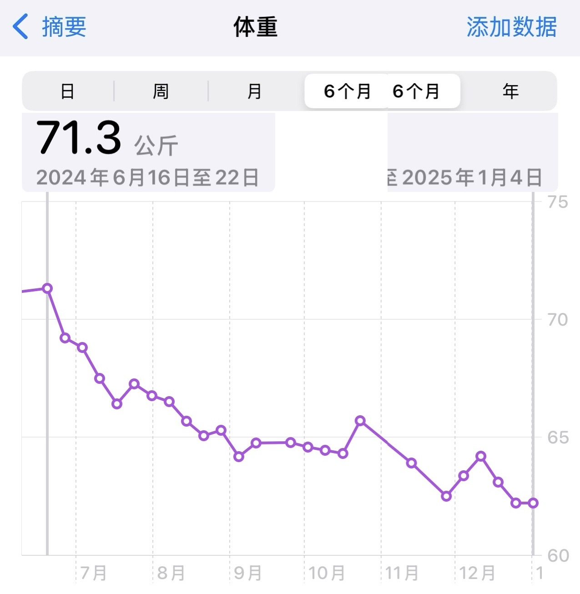
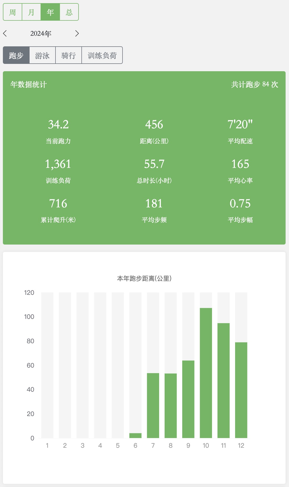

一年又一年, 记录下流水账和当前想法, 想到哪就记到哪吧.. 其实 ** 是没有记忆的

## 工作

想想这几年的工作, 其实变化挺大的. 从最初写代码 写产品功能, 到一手客户反馈 返带到产品设计, 整个过程就像一道菜谱, 不断 <u><b>琢磨</b></u> 和修正完善

经历着不同的工作内容、不同目标人群, 交叉变换, 自身技能树、<u><b>思维方式</b></u> 上不断的学习和总结, 有意思且有挑战

这是每个时间过程中的一段, 也终有结束的那天. 在今年初下好决心 “彻底放空” 停下来, 开始过个暑假寒假吧

如今半年过去, 现在不再需要频繁看手机提醒, 也没有一天十来个会议来回穿插... 强迫症解除, 长期紧绷的神经质有效缓解

## 减肥

人啊, 在停下来之后 总得找点事情和目标.. 不然容易胡思乱想

回归到健康第一位: 先降体重, 对比各种花里胡哨的减肥理论, 重点几个字: 管住嘴 迈开腿

- 体重从巅峰 71.3KG (06.18) 降到 62.2KG (12.31), 年底还在努力
- 饮食上其实还好, 不节食, 规律三餐, 7~8 分饱即可, 晚饭早点吃, 早吃早消化
- 运动上要相信科学, 从快走到慢跑结合, 不能一下子太猛, 不受伤 & 放长线才是王道

最开始的 2~3 月数字比较明显, 接下来就是长期的 <u><b>坚持</b></u> (自控力考验) 到目前为止没太大反弹, 进入 “健康型”

## 烧菜

靠着刷视频, 攒了一波经验, 在菜的品种和质量上比较稳定发挥

- 卤 鸡** (鸡爪、鸡翅和鸡腿..) 较省事, 全靠调料的种类数量, 一顿猛料
- 炒菜必备佐料: 蒜头和生姜, 炒菜缺了蒜 味道少一半

目前还不会 `孙悟空颠勺.gif` 卡在这一档有点久

## 运动

算起来从七月份开始跑步, 慢慢恢复到 <u><b>习惯</b></u> 大概经历了小半年时间

- 半年总跑量 456KM, 主打: 慢
- 马拉松 2 场: 杭州 (人品爆发半马中签)、吴哥窟

跑步间歇 翻阅了不少视频以及历史跑步记录 (主要是心率), 还是得相信科学

- 找个当前适合身体状态的课程: 别自由放飞, 慢慢来
- 补齐装备: 跑步手表 (AW S9)、蓝牙心率带 (Polar H10, 据说是黄金标杆)
- 以 <u><b>有氧慢跑</b></u> 为主, 最开始基本 8~9 km/h 溜达, 熬时间

从杭马半程完赛时间来说, 有氧跑效果还是有点用

## 外面的世界

趁着 <a href="/tags/marathon/">跑马</a> 行程, 去东南亚溜达了一圈:

> 杭州 -> 昆明 -> 柬埔寨 (暹粒) -> 新加坡 -> 马来西亚 (亚庇/仙本那) -> 杭州

整个行程跨 秋天/夏天/冬天 三季, 有点都快切换不过来了

暹粒 (柬埔寨) 天气有点像北方的夏天, 白天干热, 晚上还行, 不开空调也凑乎

- 主要交通工具: `突突车`, Grab app 挺好用 很丝滑 (附近距离基本 $1~$2), 减少很多语言困难
- 基本旅游路线: 大圈、小圈和外圈, 旅游人群中欧美皮肤居多, 中国人非常少
- 当地饮食遵从 “吃的别看, 看了别吃“ .. 你懂的

亚庇 (马来西亚) 满大街的老态汽油车和重重的尾气, 竟然空气质量以及蓝天可见度还挺好

- 饮食种类上比新加坡好一些, 尤其是价格非常友好..
- 酒很少, 晚上基本不卖

有点可惜没蹲到丹绒亚路海滩日落.. 仙本那 (马来西亚) 哈哈哈 基本好多中国人

- 距离机场非常远... 约 85KM+ 路程, 在 一望无际 无边无际 橡胶还是棕榈树林 中穿行
- 海不错, 蓝天白云, 跳岛路线成熟